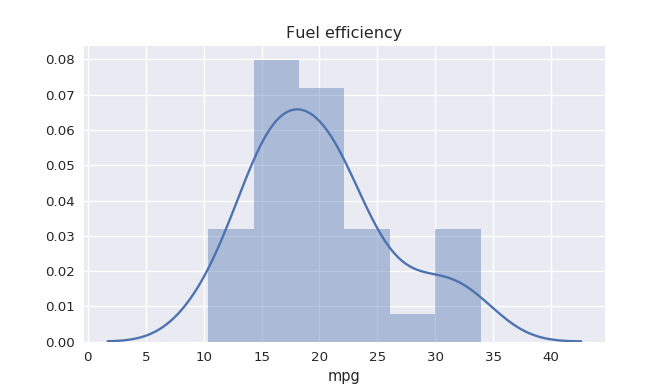

Python in R Markdown
================
Karan Rao

Running Python code in R Markdown can be useful when Python has certain
packages or functions R doesn't, or if you're more comfortable
performing certain procedures in Python, such as cleaning data or
working with strings. Python also has the edge for machine learning
packages. One possible workflow could be using Python for cleaning, R
for exploratory analysis and plotting, and Python again for machine
learning. <br/> <br/> Here, we need the `reticulate` package and a
Python installation which we can specify by location. We can specify
versions of Python with the names of their environments in
`use_virtualenv()` and `use_condaenv()`. Instead of the usual `{r}`, we
use `{python}` at the start of a Python chunk.

``` r
#R
library(reticulate)
use_python("/home/karan/anaconda3/bin/python3.5")
```

Objects can be passed easily between R and Python code chunks. To access
a Python object in R, prefix it with `py$`. To access an R object in
Python, prefix it with `r.`

``` r
#R
string_list = c("R", "and", "Python")
```

When an R vector is accessed from a Python code chunk, it automatically
becomes a list. The reverse is also true.

``` python
#Python
sentence = " ".join(r.string_list)
```

``` r
#R
print(py$sentence)
```

    ## [1] "R and Python"

``` r
#R
print(class(py$sentence))
```

    ## [1] "character"

Other datatype transformations that occur when objects are passed
between R and Python:
<table>
<thead>
<tr>
<th>
R
</th>
<th>
Python
</th>
<th>
Examples
</th>
</tr>
</thead>
<tbody>
<tr>
<td>
Single-element vector  
</td>
<td>
Scalar
</td>
<td>
<code>1</code>, <code>1L</code>, <code>TRUE</code>, <code>"foo"</code>
</td>
</tr>
<tr>
<td>
Multi-element vector
</td>
<td>
List
</td>
<td>
<code>c(1.0, 2.0, 3.0)</code>, <code>c(1L, 2L, 3L)</code>
</td>
</tr>
<tr>
<td>
List of multiple types
</td>
<td>
Tuple
</td>
<td>
<code>list(1L, TRUE, "foo")</code>
</td>
</tr>
<tr>
<td>
Named list
</td>
<td>
Dict
</td>
<td>
<code>list(a = 1L, b = 2.0)</code>, <code>dict(x = x\_data)</code>
</td>
</tr>
<tr>
<td>
Matrix/Array
</td>
<td>
NumPy ndarray
</td>
<td>
<code>matrix(c(1,2,3,4), nrow = 2, ncol = 2)</code>
</td>
</tr>
<tr>
<td>
Data Frame
</td>
<td>
Pandas DataFrame  
</td>
<td>
<code>data.frame(x = c(1,2,3), y = c("a", "b", "c"))</code>
</td>
</tr>
<tr>
<td>
Function
</td>
<td>
Python function
</td>
<td>
<code>function(x) x + 1</code>
</td>
</tr>
<tr>
<td>
Raw
</td>
<td>
Python bytearray
</td>
<td>
<code>as.raw(c(1:10))</code>
</td>
</tr>
<tr>
<td>
NULL, TRUE, FALSE 
</td>
<td>
None, True, False
</td>
<td>
<code>NULL</code>, <code>TRUE</code>, <code>FALSE</code>
</td>
</tr>
</tbody>
</table>
<h5>Table source: https://cran.r-project.org/web/packages/reticulate/vignettes/calling_python.html</h5>

``` r


```

If all you need is a couple of lines of Python (or you're
writing an R script instead of Markdown), an alternative is the
`py_run_string()` function, or the mostly equivalent `py_eval()`.
`py_eval()` returns the result of evaluating the expression as opposed
to the dictionary associated with the code execution. Both belong to the
`reticulate` package.
<br/>

``` r
#R
py_run_string("x = ['short', 'order']")
print(py$x)
```

    ## [1] "short" "order"

You can also run a Python script with `py_run_file('script.py')`.
`source_python('script.py')` is equivalent to importing a Python script.
It makes all of its public objects (such as functions) available in the
R environment. <br/> Here's an example that passes a dataframe from R to
Python and uses `py_eval()`:

``` r
#R
data("mtcars")
py_eval("r.mtcars.describe()")
```

    ##              mpg        cyl        disp   ...            am       gear     carb
    ## count  32.000000  32.000000   32.000000   ...     32.000000  32.000000  32.0000
    ## mean   20.090625   6.187500  230.721875   ...      0.406250   3.687500   2.8125
    ## std     6.026948   1.785922  123.938694   ...      0.498991   0.737804   1.6152
    ## min    10.400000   4.000000   71.100000   ...      0.000000   3.000000   1.0000
    ## 25%    15.425000   4.000000  120.825000   ...      0.000000   3.000000   2.0000
    ## 50%    19.200000   6.000000  196.300000   ...      0.000000   4.000000   2.0000
    ## 75%    22.800000   8.000000  326.000000   ...      1.000000   4.000000   4.0000
    ## max    33.900000   8.000000  472.000000   ...      1.000000   5.000000   8.0000
    ## 
    ## [8 rows x 11 columns]

We can also use Python graphing libraries.

``` python
#Python
import pandas as pd
import seaborn as sns
sns.set(rc={'figure.figsize':(7,4)})
sns.distplot(r.mtcars.mpg).set_title("Fuel efficiency")
```


<h3>Working with dictionaries</h3> <br/>
Accessing the keys and values of a Python dictionary from R can be
confusing at first. This is because Python dictionaries become named
lists in R.

``` python
#Python
cc = {"course":"edav", "year":2019}
```

This is equivalent to:

``` r
#R
cc_r <- list(course = "edav", year = 2019)
print(names(cc_r))
```

    ## [1] "course" "year"

So the original Python object's details can be accessed as below:

``` r
#R
print(names(py$cc))
```

    ## [1] "course" "year"

``` r
#R
print(reticulate::dict(py$cc))
```

    ## {'course': 'edav', 'year': 2019}

``` r
#R
print(reticulate::dict(py$cc)$keys())
```

    ## dict_keys(['course', 'year'])

<br/> <h3>Miscellaneous</h3> <br/> Other packages
that allow you to run Python code from within R are
[rJython](https://r-forge.r-project.org/projects/rjython/),
[rPython](https://cran.r-project.org/web/packages/rPython/index.html),
[SnakeCharmR](https://github.com/asieira/SnakeCharmR), and
[PythonInR](https://bitbucket.org/Floooo/pythoninr/). <br/> Running the
`repl_python()` function converts the R console to a Python session, and
the objects you create are persistent and can be accessed with the usual
`py$` later. Type `exit` to return to the R console when you're done.
This also belongs to the `reticulate` package.

``` r


```

<h3>Limitations and troubleshooting</h3> 
In older versions of RStudio (before 1.2.1114), running Python chunks directly in
the IDE to see output is not supported - they can only be run while
knitting. To check if your output works, you can use `repl_python()` as
a workaround. You can also put your code in `py_run_string()` in an R
chunk. <br/> It's best to use the latest version of RStudio, which
clears up issues related to loading the right Python environments and
newly installed Python libraries. <br/>

<h3>Sources</h3> 

[Reticulate on RStudio's GitHub page](https://rstudio.github.io/reticulate/)

[Reticulate vignettes](https://cran.r-project.org/web/packages/reticulate/vignettes/calling_python.html)  

[InfoWorld - How to run Python in R](https://www.infoworld.com/article/3340120/how-to-run-python-in-r.html)  

[Running Python from R with Reticulate by Len Kiefer](http://lenkiefer.com/2019/01/28/running-python-from-r-with-reticulate/)  

[From ‘R vs Python’ to ‘R and Python’ - Towards Data Science](https://towardsdatascience.com/from-r-vs-python-to-r-and-python-aa25db33ce17)  

[Snakes in a Package](https://www.mango-solutions.com/blog/snakes-in-a-package-combining-python-and-r-with-reticulate)  

[R Markdown: The Definitive Guide by Xie, Allaire & Grolemund](https://bookdown.org/yihui/rmarkdown/language-engines.html#python)

[Listen Data - Run Python from R](https://www.listendata.com/2018/03/run-python-from-r.html)  

[StackOverflow - calling Python methods from R](https://stackoverflow.com/questions/51108722/how-to-call-python-method-from-r-reticulate)  

[StackOverflow - running Python chunks in RStudio](https://stackoverflow.com/questions/49503195/reticulate-running-python-chunks-in-rmarkdown)
